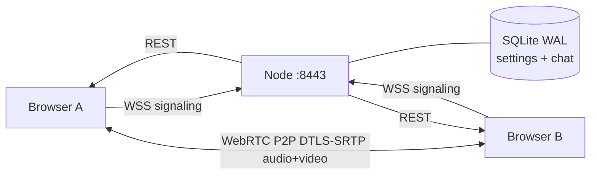

# HALCYON

> Self-hosted realtime mesh voice/video platform.
> Local-first, zero-cloud — your LAN, your data.

[](LICENSE)
[](https://nodejs.org)
[](#stack)
[](#accessibility)

## What it is

HALCYON is a **self-hosted realtime communication platform** designed to run
entirely on your LAN. Two peers, two minutes, zero accounts. The whole
stack is vanilla JavaScript on the client and a single Node entry point
on the server.

- **Mesh WebRTC P2P** with W3C-spec **perfect-negotiation** glare handling
  so either peer can add tracks (camera, screen-share) mid-call without
  the remote peer getting stuck on a missed renegotiation.
- End-to-end DTLS-SRTP audio between peers, no server in the media path.
- **1080p60 video** with codec preference AV1 → H.264 (NVENC if
  available) → VP9 → VP8, max-bitrate 6 Mbps, hardware-accelerated when
  available.
- **Screen sharing with tab/system audio** capture — the screen-share
  audio rides on the same `MediaStream` as the video and plays through
  the remote `<video>` tile (the mic `<audio>` element stays
  independent, so neither stream overwrites the other).
- **Resilient signaling**: WebSocket reconnect with exponential backoff
  and jitter, ICE restart on `failed`, 30 s session-grace window
  server-side.
- **Persistent profiles** via SQLite (`data/app.db`) and a tiny REST
  API. Settings sync local-first then server.
- **Multi-room** via `?room=<id>` URL parameter, chat scoped per room.
- **Markdown chat** with reactions, edits, soft-delete, mention
  rendering, XSS-safe parser (URL whitelist `https?:` / `mailto:` only).
- **Four themes**: default cosmic, Matrix, Cyberpunk, Apple Glass.
- **Accessible**: WCAG-aligned focus indicators, ARIA pressed/expanded
  state, live-region announcements, `prefers-reduced-motion` &
  `prefers-contrast` aware.

One port (`:8443`). One launcher. One LAN. No third-party services.

## Stack

| Layer   | What                                                                   |
| ------- | ---------------------------------------------------------------------- |
| Server  | Node 24 ESM, `https` + `WebSocketServer` (`ws`), `selfsigned` certs    |
| Storage | `better-sqlite3` WAL, single file `data/app.db` (settings + chat)      |
| Client  | Vanilla JS ES Modules + DOM render, **no build step, no dependencies** |
| Static  | In-memory ETag cache, Brotli + gzip negotiation, 304 conditional GET   |
| Tests   | `vitest` (34 unit) + `playwright` (chromium, audio fake-routing)       |
| Lint    | `prettier` 3.8 + `eslint` v9 flat config                               |

## Quick start

```cmd
git clone https://github.com/999purple999/halcyon.git
cd halcyon
npm install
npm start
```

Then open `https://localhost:8443` in Chrome 124+. Accept the
self-signed certificate, pick a nickname, join. Share
`https://<your-LAN-IP>:8443` with a friend on the same network and
you're talking.

For separate rooms add `?room=<name>` to the URL.

## Architecture



The Node server does only:

- HTTPS static (ETag + brotli/gzip)
- WebSocket signaling relay (offer/answer/ICE)
- REST `/api/settings` (UUID-keyed JSON blobs)
- WebSocket chat (per-room broadcast + SQLite persistence)
- Health probes (`/healthz`, `/readyz`)

The media never transits the server. Once two peers exchange SDP via
the WebSocket, their browsers establish a direct P2P
`RTCPeerConnection`.

## Features

| Audio           | Video            | Chat               | UX                             |
| --------------- | ---------------- | ------------------ | ------------------------------ |
| Mesh P2P Opus   | Camera 1080p60   | Markdown           | 4 themes                       |
| Mute / deafen   | Screen + audio   | Reactions emoji    | Keyboard shortcuts             |
| AEC toggle      | Codec AV1/NVENC  | Mentions `@user`   | Push-to-talk (Space)           |
| VU meter input  | Per-peer tile    | Edit / delete      | Stats panel `Ctrl+Shift+D`     |
| Test beep       | Self-tile mirror | Typing indicator   | Audio gate fallback            |
| Per-peer volume | Self preview     | Incremental render | Reduced motion / high contrast |

## Keyboard shortcuts

| Key            | Action              |
| -------------- | ------------------- |
| `M`            | Toggle microphone   |
| `Space` (hold) | Push-to-talk        |
| `D`            | Deafen (silence in) |
| `C`            | Toggle camera       |
| `S`            | Toggle screen share |
| `T`            | Local test beep     |
| `Ctrl+Shift+D` | Stats / debug panel |
| `?`            | Shortcut cheatsheet |
| `Esc`          | Close panels        |

## Accessibility

HALCYON is built keyboard-first and screen-reader friendly:

- All interactive controls expose `aria-pressed` / `aria-expanded` and
  full `aria-label`s.
- A polite `aria-live` region announces toggles (mute / deafen / new
  chat) for VoiceOver / NVDA.
- `:focus-visible` outlines are explicit but suppressed for
  mouse-driven focus.
- Skip-link jumps from `<body>` to the participants grid.
- `@media (prefers-reduced-motion: reduce)` disables aurora,
  shimmer, entrance and pulse animations.
- `@media (prefers-contrast: more)` thickens borders and lightens
  muted text.

## Performance

The client is hot-path conscious:

- **Pause-on-hidden** — the rAF tick loop is fully suspended when the
  tab loses visibility (`document.hidden`); `getStats()` polling also
  skips background ticks.
- **Incremental chat render** — new messages append to the DOM,
  edits/deletes/reactions mutate the existing node in place. No more
  full-list rebuild on every event (preserves text selection & scroll).
- **Cached DOM lookups** — the participants grid uses a `Map<id, el>`
  to avoid a `querySelector` per peer per frame.
- **Threshold-gated CSS var writes** — speaking-intensity (`--rms`)
  only updates on delta ≥ 0.02 to avoid style recalc spam.
- **Compressed FFT** — the audio analyser uses `fftSize=256` (half of
  the original), since DOM rendering doesn't need fine-grained bins.
- **Smaller paint area** — the heavy multi-radial-gradient star-drift
  layer is gone; aurora is a single softer layer.
- **Static asset cache** — server keeps SHA-1 ETags in memory and
  serves brotli/gzip pre-compressed bodies; `If-None-Match` returns
  `304` with zero body for unchanged reloads.

The result: app.js is **~20% smaller**, CSS is **~10% smaller**, and a
typical Discord-style busy chat (~200 messages) no longer drops frames
on each new message.

## Privacy

- All media is end-to-end encrypted (WebRTC DTLS-SRTP, mandatory).
- Chat is stored only in `data/app.db` on your server. Nothing leaves
  the LAN.
- The self-signed certificate is generated once on first run and
  cached in `certs/`. You can replace it with a real cert if you want.
- No telemetry. No analytics. No third-party scripts.
- HTTPS responses set `X-Content-Type-Options: nosniff` and
  `Referrer-Policy: no-referrer`.

## Testing

```cmd
npm run lint           :: eslint + prettier
npm run test:unit      :: vitest  (34 tests)
npm run test:e2e       :: playwright chromium
npm run verify         :: full local CI suite
```

The e2e suite includes `bidir_renegotiation.spec.js` which validates
the perfect-negotiation fix by having both peers add a camera track at
runtime (the same code path that screen-share uses), then asserting
zero entries in the client error ring.

## Changelog

### v1.2.1

- **Fixed: screen-share never started**. `getDisplayMedia` was being
  called with the same `VIDEO_PROFILE_HQ` constraints object as
  `getUserMedia`, which contains `min:` keys for camera fallback. The
  spec forbids `min` on `getDisplayMedia` → Chrome rejected with
  `TypeError: min constraints are not supported`. The error was logged
  but no user-visible toast surfaced it. Now the call uses an
  `ideal`-only subset of the constraints, plus a video-only retry and
  an error toast for any remaining failure mode.
- New `tests/e2e/screen_share.spec.js` exercises the full click-to-tile
  pipeline end-to-end using Chrome's fake-ui auto-accept.

### v1.2.0

- **Fixed: screen-share / camera from the non-initiator peer**. The
  previous code attached `negotiationneeded` only on the initiator side,
  so when the second peer added a track at runtime no SDP renegotiation
  fired and the remote saw nothing. Rewritten with the W3C
  perfect-negotiation pattern (polite/impolite glare handling).
- **Fixed: screen-share audio was overwriting mic audio**. The screen
  audio track shares its `MediaStream` with the screen video; it now
  plays through the remote `<video>` element instead of replacing the
  mic `<audio>` element's `srcObject`.
- **Fixed: `maximizeBitrate` could crash on an empty encodings array**,
  bubbling as an unhandled rejection during early renegotiation. Now
  defensive and never throws.
- UI fully translated to English (HTML, JS strings, server banner).
- New e2e test `bidir_renegotiation.spec.js`.

### v1.1.0

- Removed ~500 lines of dead canvas-radar and SFU code (`-20%` JS,
  `-9%` CSS).
- A11y polish: `prefers-reduced-motion`, `prefers-contrast`,
  `:focus-visible`, skip-link, ARIA pressed/expanded sync, live-region
  announcements.
- Perf: pause-on-hidden rAF loop, incremental chat render, cached
  participants-grid lookups, FFT size halved, single-layer aurora.
- Server: in-memory ETag cache + Brotli/gzip negotiation + 304
  conditional GET, security headers.

## License

[GPL-3.0-or-later](LICENSE). Copyleft.
