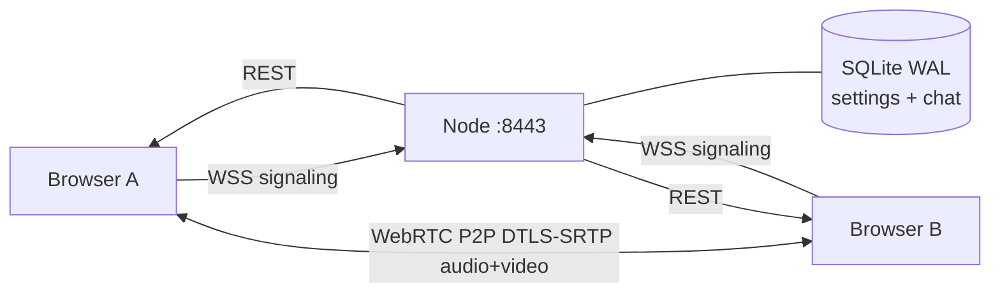

# HALCYON

> Self-hosted realtime mesh voice/video platform.
> Local-first, zero-cloud, your LAN, your data.

[](LICENSE)
[](https://nodejs.org)

## What it is

HALCYON is a **self-hosted realtime communication platform** designed to run
entirely on your LAN. Two peers, two minutes, zero accounts. The whole
stack is vanilla JavaScript on the client and a single Node entry point
on the server.

- **Mesh WebRTC P2P**: end-to-end DTLS-SRTP audio between peers, no
  server in the media path.
- **1080p60 video** with codec preference AV1 → H.264 (NVENC if
  available) → VP9 → VP8, max-bitrate 6 Mbps.
- **Screen sharing with tab/system audio** capture.
- **Resilient signaling**: WebSocket reconnect with exponential backoff
  and jitter, ICE restart on `failed`, 30 s session-grace window
  server-side.
- **Persistent profiles** via SQLite (`data/app.db`) and a tiny REST
  API.
- **Multi-room** via `?room=<id>` URL parameter, chat scoped per room.
- **Markdown chat** with reactions, edits, soft-delete, mention
  rendering, XSS-safe parser (URL whitelist `https?:` / `mailto:` only).
- **Four themes**: default cosmic, Matrix, Cyberpunk, Apple Glass.

One port (`:8443`). One launcher. One LAN. No third-party services.

## Stack

| Layer | What |
|---|---|
| Server | Node 24 ESM, `https` + `WebSocketServer` (`ws`), `selfsigned` certs |
| Storage | `better-sqlite3` WAL, single file `data/app.db` (settings + chat) |
| Client | Vanilla JS ES Modules + DOM render, no build step |
| Tests | `vitest` + `playwright` (chromium) |
| Lint | `prettier` 3.8 + `eslint` v9 flat config |

## Quick start

```cmd
git clone https://github.com/999purple999/halcyon.git
cd halcyon
npm install
npm start
```

Then open `https://localhost:8443` in Chrome 124+. Accept the
self-signed certificate, pick a nickname, join. Share
`https://<your-LAN-IP>:8443` with a friend on the same network and
you're talking.

For separate rooms add `?room=<name>` to the URL.

## Architecture



The Node server does only:

- HTTPS static
- WebSocket signaling relay (offer/answer/ICE)
- REST `/api/settings` (UUID-keyed JSON blobs)
- WebSocket chat (per-room broadcast + SQLite persistence)

The media never transits the server. Once two peers exchange SDP via
the WebSocket, their browsers establish a direct P2P
RTCPeerConnection.

## Features

| Audio | Video | Chat | UX |
|---|---|---|---|
| Mesh P2P Opus | Camera 1080p60 | Markdown | 4 themes |
| Mute / deafen | Screen + audio | Reactions emoji | Keyboard shortcuts |
| AEC toggle | Codec AV1/NVENC | Mentions `@user` | Push-to-talk (Space) |
| VU meter mix | Per-peer tile | Edit / delete | Stats panel `Ctrl+Shift+D` |
| Test beep | Self-tile mirror | Typing indicator | Audio gate fallback |

## Keyboard shortcuts

| Key | Action |
|---|---|
| `M` | Toggle microphone |
| `Space` (hold) | Push-to-talk |
| `D` | Deafen (silence incoming) |
| `C` | Toggle camera |
| `S` | Toggle screen share |
| `T` | Local test beep |
| `Ctrl+Shift+D` | Stats / debug panel |
| `?` | Shortcut cheatsheet |
| `Esc` | Close panels |

## Privacy

- All media is end-to-end encrypted (WebRTC DTLS-SRTP, mandatory).
- Chat is stored only in `data/app.db` on your server. Nothing leaves
  the LAN.
- The self-signed certificate is generated once on first run and
  cached in `certs/`. You can replace it with a real cert if you want.
- No telemetry. No analytics. No third-party scripts.

## Testing

```cmd
npm run lint           :: eslint + prettier
npm run test:unit      :: vitest
npm run test:e2e       :: playwright chromium
npm run verify         :: full local CI suite
```

## License

[GPL-3.0-or-later](LICENSE). Copyleft.
